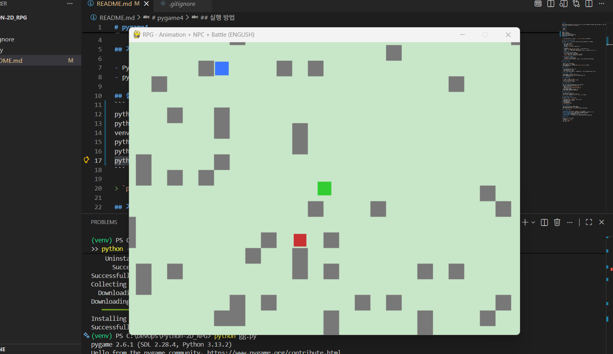

# pygame4

간단한 2D RPG 프로토타입을 `pygame`으로 구현한 단일 파일 프로젝트입니다. 무작위 맵 생성, 타일 기반 충돌 처리, NPC 대화, 몬스터 조우, 턴 기반 전투 UI를 포함합니다.



## 기술 스택

- Python 3
- pygame

## 실행 방법
```
python --version
python -m venv venv
venv\Scripts\Activate.ps1
python -m pip install --upgrade pip
python -m pip install pygame
python gg.py
```

> `pygame`가 설치되어 있지 않다면 먼저 `pip install pygame`를 실행하세요.

## 기술 구조 (Technical Overview)

프로젝트는 `gg.py` 한 파일에 핵심 로직이 모여 있으며, 아래 계층으로 구성됩니다.

1. **환경/렌더링 초기화**
   - 화면 해상도: `800x600`
   - 타일 크기: `32px`
   - 맵 크기: `50 x 40` 타일
   - 메인 루프: `clock.tick(60)` 기반 60 FPS

2. **월드 생성**
   - 맵 데이터(`MAP_DATA`)는 벽(`#`)과 바닥(`.`) 문자열 배열로 생성
   - 벽 비율은 확률 기반(`random.random() < 0.1`)
   - 각 타일은 `Tile` 스프라이트로 인스턴스화되며, 벽 타일은 별도 그룹(`walls`)에 저장

3. **엔티티 모델**
   - `Tile`: 월드 지형 표현(벽/바닥)
   - `NPC`: 상호작용 가능한 대화 엔티티
   - `Monster`: 전투 대상, 개체별 `hp/atk` 랜덤 스탯
   - `Player`: 입력/이동/애니메이션/근접 판정 담당

4. **상태 머신 (게임 흐름)**
   - `dialog_open`: 대화 UI 표시 여부
   - `battle_mode`: 전투 UI 표시 여부
   - 상태에 따라 플레이어 업데이트를 제어하여, 대화/전투 중에는 이동이 비활성화됨

## 핵심 시스템 상세

### 1) 입력 및 이동

- 이동 키: `WASD` 또는 방향키
- 입력은 벡터(`dx`, `dy`)로 계산
- 이동 방향을 바탕으로 애니메이션 방향(`up/down/left/right`) 업데이트
- 속도: 프레임당 `4px`

### 2) 충돌 처리

- 축 분리(Axis-separated) 방식 적용
  1. X축 이동 후 벽 충돌 보정
  2. Y축 이동 후 벽 충돌 보정
- 이 방식은 타일 기반 게임에서 충돌 안정성을 높이고, 코너 끼임 현상을 단순하게 제어함

### 3) 플레이어 애니메이션

- 방향별 2프레임 애니메이션 테이블 사용
- 이동 중 타이머(`anim_timer`) 누적으로 프레임 인덱스 순환
- 정지 시 기본 프레임으로 복귀

### 4) 상호작용(NPC)

- `E` 키로 근접 NPC와 대화 시작
- 근접 판정은 `rect.inflate(20, 20)` 기반
- 대화창은 하단 박스 UI로 렌더링
- `ESC` 또는 `ENTER`로 대화 종료

### 5) 몬스터 조우 및 전투

- 비전투/비대화 상태에서 몬스터 근접 시 전투 모드 진입
- 전투 UI는 플레이어/몬스터 HP와 조작 힌트 표시
- `ENTER`: 공격 턴 수행
  - 플레이어 피해량: `randint(5, player.atk)`
  - 몬스터 생존 시 반격: `randint(3, monster.atk)`
- `ESC`: 도주(전투 종료)
- 몬스터 HP가 0 이하가 되면 그룹에서 제거
- 플레이어 HP가 0 이하가 되면 게임 종료

### 6) 카메라 시스템

- 카메라가 플레이어 중심을 추적
- 월드 경계를 넘지 않도록 `clamp` 계산 적용
- 렌더링 시 모든 스프라이트를 `(world - camera)` 좌표로 오프셋

## 이벤트 루프와 업데이트 순서

매 프레임마다 아래 순서로 진행됩니다.

1. 이벤트 처리(`QUIT`, `KEYDOWN`, 대화/전투 입력)
2. 상태에 따른 플레이어 업데이트
3. 몬스터 조우 체크
4. 카메라 위치 갱신
5. 월드/엔티티/UI 렌더링
6. `pygame.display.flip()`

## 현재 구조의 장점

- 단일 파일이라 학습/프로토타이핑이 빠름
- 스프라이트 그룹을 사용해 객체 관리가 단순함
- 상태 플래그(`dialog_open`, `battle_mode`)로 흐름 제어가 명확함

## 개선 포인트 (기술적)

- **모듈 분리**: `entities.py`, `systems/`, `ui/`로 구조화
- **리소스 파이프라인**: Surface placeholder 대신 스프라이트 시트/에셋 로더 적용
- **전투 시스템 확장**: 스킬, 턴 큐, 상태이상 등 데이터 중심 설계
- **저장/불러오기**: JSON 기반 세이브 상태 관리
- **맵 생성 고도화**: 방/복도 기반 절차적 생성, 시작 지점 보장
- **테스트 가능성 개선**: 랜덤 시드 고정 + 순수 로직 분리로 단위 테스트 도입

## 조작 키 요약

- 이동: `W/A/S/D` 또는 방향키
- 상호작용: `E`
- 대화 닫기: `ESC`, `ENTER`
- 전투 공격: `ENTER`
- 전투 도주: `ESC`
